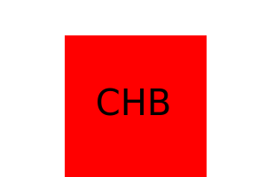

Project: LOGO MAKER

## Description
***

This is an SVG Logo Maker built as a way to create simple logos for their clients and projects It utilizes inquirer to prompt the user within the command line for Logo text color, shape (triangle, square, or circle) and shape color using install Node JS module,  Jest  for running the unit tests and Inquirer. 

## Table of Contents
*** 
- [Installation](#installation)
- [Usage](#usage)
- [Technologies](#Technologies)
- [Examples](#Examples)
- [Contributing](#contributing)
- [Tests](#Tests)
- [Contact](#contact)
- [License](#license)

##Installation
***

The installation can be completed by following these instructions:

1. To install a Node JS project, install [Node JS](https://nodejs.org/) use [Jest](https://www.npmjs.com/package/jest) for running the unit tests and [Inquirer](https://www.npmjs.com/package/inquirer/v/8.2.4)
2. Clone the GitHub repository to you local computer. Click on the following link.
* Repository link : https://github.com/bchamidou/OOP_SVG_LOGO_MAKER  

## Usage 
***
To execute the script, open a Git terminal on the main project folder (cloned folder) Run the following command: node index.js.

Project Logo Made

Screenshots

    

walkthrough video link

    

    https://drive.google.com/file/d/17zRfgNgN_i8cK-Np0GZW9mQLXXJ8MlR_/view?usp=drive_link

## Technologies
***
This project is powered by Node.js v16, utilizes inquirer v8.2.4 (node package manager), and file system module (node package manager). It also employs jest v29.5.0 (node package manager) for the unit testing conducted in this application.

## Contributing
***

I  utilized several coding website for help, including STackOverflow, w#schools.com, …. I also watched YouTube video tutorials and the course resources.

Any developers who are interested in contributing ideas for this application must agree to follow and comply with the Contributor Covetnant: Code of Conduct.
The Contributor Covenant Code of Conduct can be found in the following address:

[Contributor Covenant Code of Conduct](https://www.contributor-covenant.org/version/2/0/code_of_conduct/code_of_conduct.md/)

## Tests Passing
***

## Contacts
***

For additional questions, please contact by email: bchamidou@gmail.com.
or my Github page:(https://github.com/bchamidou@gmail.com)

## License
***

This application is covered under the MIT License.

Copyright (c) 2023 Bchamidou.

This software/code is licensed under the MIT License; 
to use this software/code you must agree to follow and comply the License.
A copy of the License can be found at: https://www.gnu.org/licenses/gpl-3.0.md 

